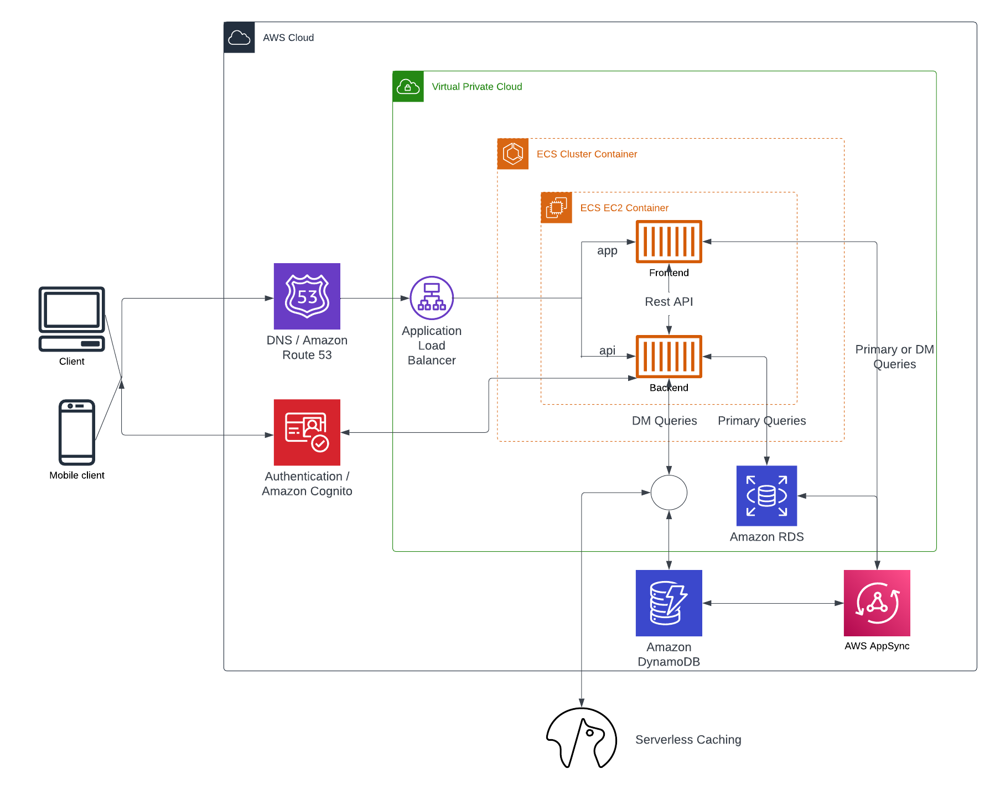

# Week 0 — Billing and Architecture

## 1. Billing

1.1 set billig alert: two ways

- using budget 
- using Cloudwatch Alarm.  

These alerts help us monitor the money that we cost in AWS. It's very helpful to remind us if out of budget.

1.2 Tags

Tags can help us manage, identify, organize, search for, and filter resources. Each tag is a label consisting of a user-defined key and value.

1.3 Cost Explorer

- AWS Management Console and open the AWS Cost Management console
- AWS Cost Explorer helps you visualize, understand, and manage your AWS costs and usage over a daily or monthly granularity.

## 2. Security

Cloud Security: 

​	Cloud security, also known as cloud computing security, is a collection of security measures designed to protect cloud-based infrastructure, applications, and data. These measures ensure user and device authentication, data and resource access control, and data privacy protection.

2.1 security credentials

AWS security credentials to verify who you are and whether you have permission to access the resources that you are requesting. 

2.2 AWS Organization unit

​    - aws account - root - children's actions -create new 

2.3 enable AWS clound trail

AWS CloudTrail helps us enable operational and risk auditing, governance, and compliance of your AWS account. Actions taken by a user, role, or an AWS service are recorded as events in CloudTrail.

2.4 IAM users

An IAM user is a resource in IAM that has associated credentials and permissions. An IAM user can represent a person or an application that uses its credentials to make AWS requests. 

## 3. Architecture Diagram

using Lucid.app

Link: https://lucid.app/lucidchart/3d1f4a6f-0aa8-4327-becd-9c0059e52415/edit?viewport_loc=-211%2C142%2C1600%2C979%2C0_0&invitationId=inv_ecb39f93-cb3d-41c7-a1ba-1fa4d7b0116a

## 4. AWS CLI - Command Line Interface 

The AWS Command Line Interface (AWS CLI) is a unified tool to manage your AWS services. With just one tool to download and configure, you can control multiple AWS services from the command line and automate them through scripts.

There are two ways to access AWS via CLI:

- installing the aws CLI from you terminal with the secret key
- use cloudshell from your the aws console